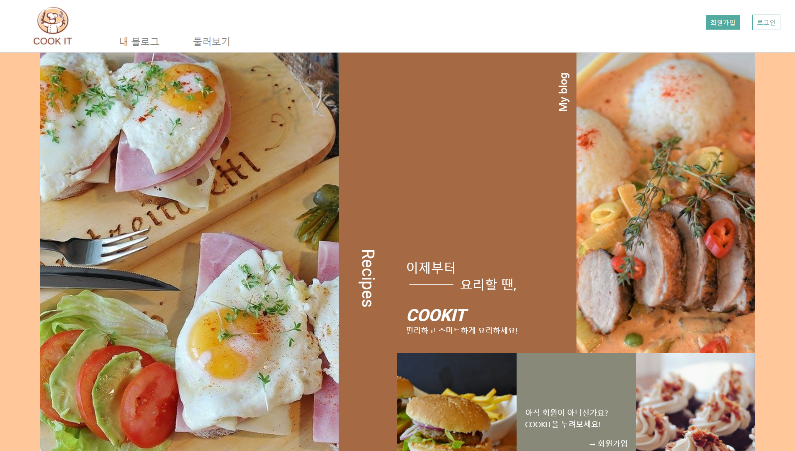
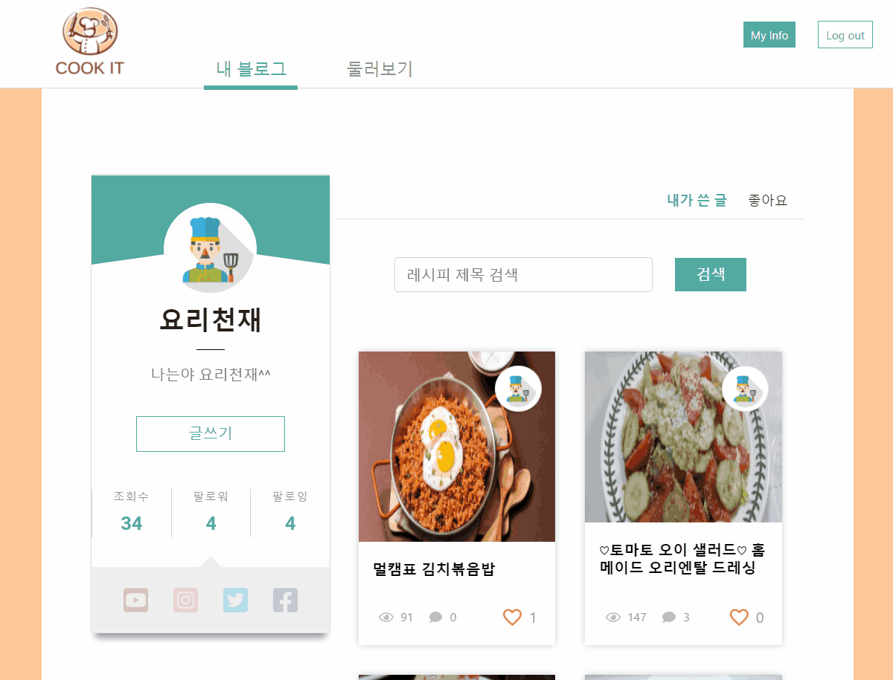
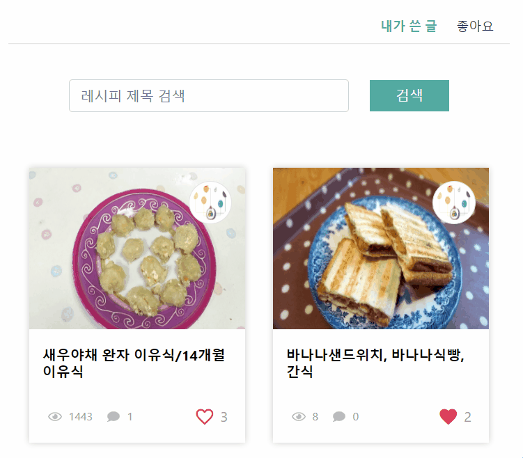
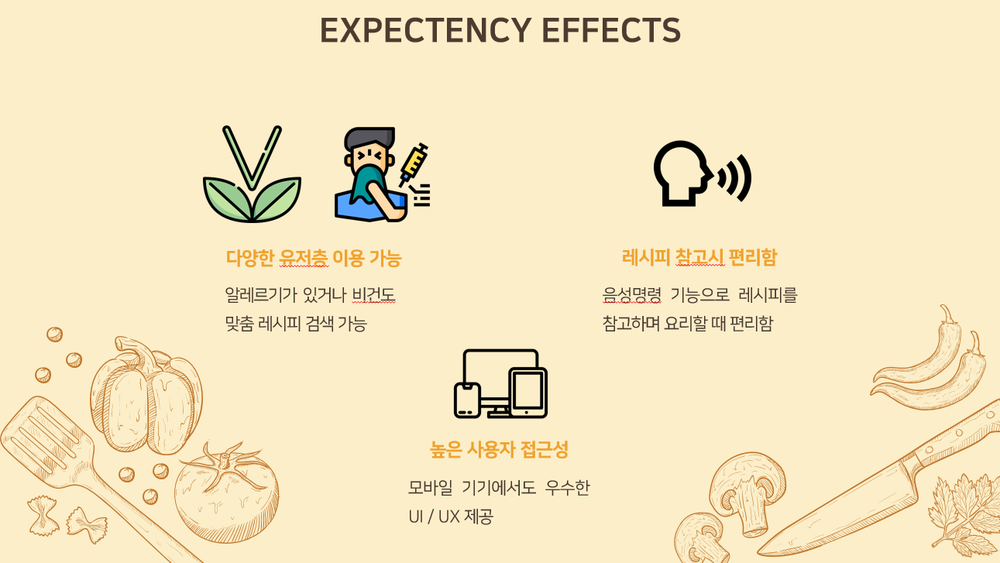
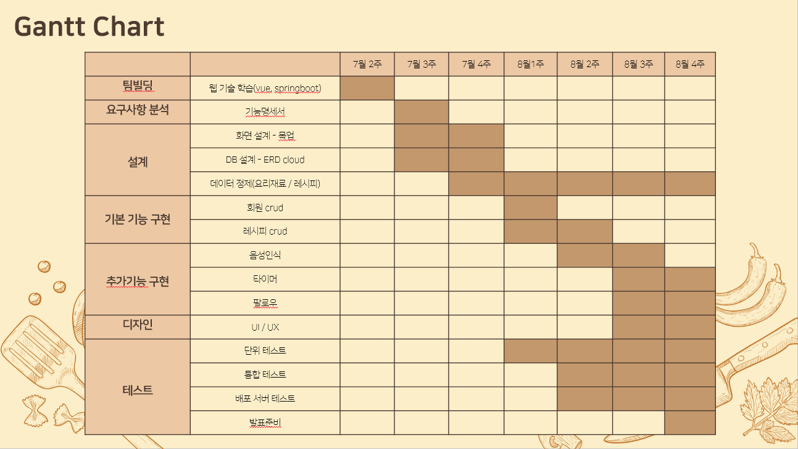

# SSAFY 3기 2반 공통 프로젝트

- [ 웹 기술 - Sub PJT 2 ] 백엔드 구성 및 기본 기능 구현
- 2020.07.13 ~ 2020.08.21 (총 6주)
- 곽은정(팀장) 김지윤 김태형 이건수 차보람

 

## 🥗 요리 블로그 CookIt 🥗

- 프로젝트 기능 명세서 [ [마크다운 ver.](notes/specification.md) ] [ [엑셀 ver.](notes/specification.xlsx) ]
- [To-do 리스트](notes/to-do.md)
- Front-end : [Mock-up](https://ovenapp.io/view/od8RcDZbTz2JoipOmIimfEljjwdyftTq/)
- Back-end : [ERD](https://www.erdcloud.com/d/JiWq5ZapHeiiuqMjw)
- [Git commit 메시지 및 merge request 규칙](notes/base-rule.md)

 

### 👉 https://i3a201.p.ssafy.io

 

 

### 🥨 내 블로그

   

- 내가 작성한 레시피와 좋아요한 레시피 모아보기

  

   

- 관심있는 유저를 팔로우 할 수 있는 기능

  

   

- 글쓰기 시 재료 입력 자동 완성

  

 

### 🍰 둘러보기

   

- 카테고리별, 제목 및 태그, 최신순, 조회순, 추천순으로 다양하게 검색

  

   

- 재료 필터링으로 원하는 레시피를 보다 쉽고 편하게 검색 가능

  

   

- 나중에 보고 싶은 레시피에 좋아요 누르기

  

 

### 🍤 레시피 뷰어

   

- 시간 부분 자동 인식되는 타이머

  

   

- 가로보기에서 자동으로 음성 인식 활성화

  

 

 

### 🌮 기대효과

 

### 🍩 일정

 

### 🍭 기술 스택 및 담당

- Front-end : 곽은정 김태형 차보람
- Back-end : 김지윤 이건수